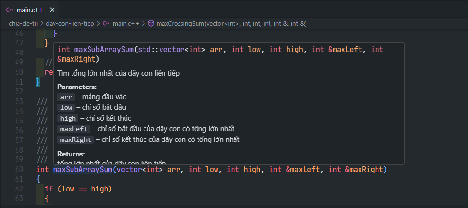

### Mở dự án này trên VSCode và chạy thử chương trình

1. Cài đặt [Visual Studio Code](https://code.visualstudio.com/download)
2. Cài đặt [C/C++ extension](https://marketplace.visualstudio.com/items?itemName=ms-vscode.cpptools)
3. Cài đặt [C/C++ compiler](https://code.visualstudio.com/docs/cpp/config-mingw)
4. Cài đặt [Code Runner extension](https://marketplace.visualstudio.com/items?itemName=formulahendry.code-runner)
5. Mở thư mục `tham-lam` trên VSCode
6. Mở từng bài `doi-tien-xu` trên VSCode
7. Nhấn tổ hợp phím `Ctrl + Shift + B` hoặc `Ctrl + Shift + N` để biên dịch chương trình

### Cấu trúc thư mục

```text
.
├── data
│   ├── input.txt (dữ liệu đầu vào chung cho tất cả các bài toán (nếu có))
│   └── ...
├── helpers
│   ├── ultilities.hpp (các hàm dùng chung cho tất cả các bài toán)
│   └── ...
├── tham-lam (phương pháp giải bài toán)
│   ├── doi-tien-xu (tên bài toán)
│   │   ├── input.txt (dữ liệu đầu vào cho bài toán (nếu có))
│   │   ├── main.cpp (chương trình chính)
│   │   ├── output.txt (kết quả đầu ra cho bài toán (nếu có))
│   │   ├── README.md (các yêu cầu của bài toán)
│   └── ...
└── ...
```

### Xem thông tin của hàm



### Cấu trúc câu hỏi

### Chia để trị: Bài toán: 4, 9, 10

### Quy hoạch động: Bài toán: 5, 7, 12 (5, 7 giống nhau)

### Tham lam: Bài toán: 1, 2, 3, 11

### Quay lui: Bài toán: 6, 13, 14

### Khác: Kết hợp nhiều cách, Bài toán: 8
